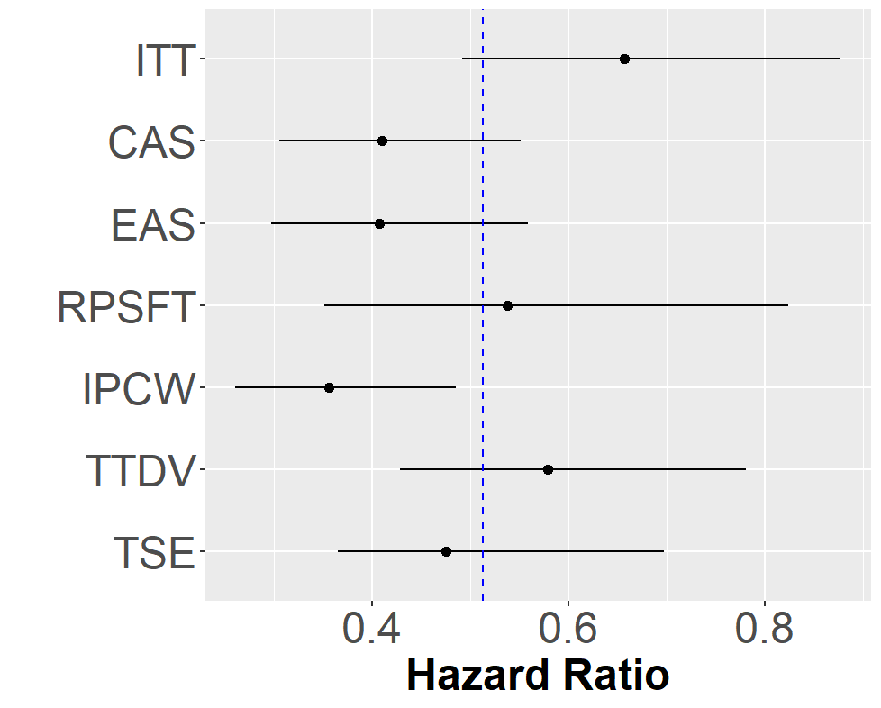
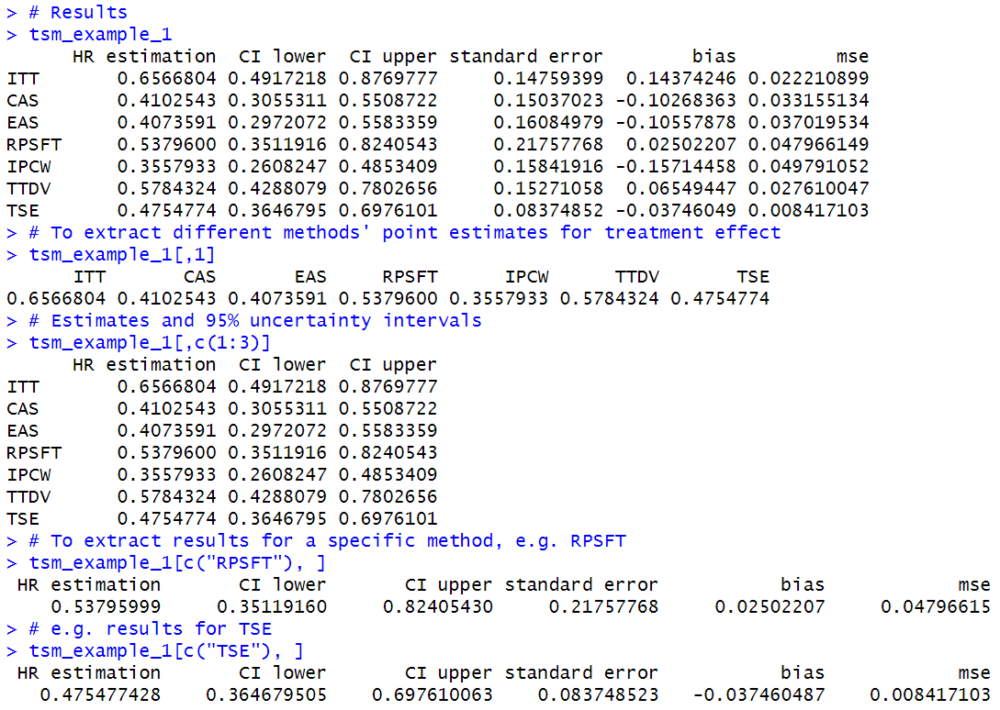

# TSM

This repository contains the code to implement the three-state model (TSM) framework in the paper "A unified three-state model framework for analysis of treatment crossover in survival trials" by Zile Zhao, Ye Li, Xiaodong Luo, and Ray Bai (preprint: https://arxiv.org/abs/2401.17008). 

Eight methods in the TSM framework can be implemented: intention-to-treat (ITT), censor-at-switching (CAS), exclude-at-switching (EAS), treatment as time-dependent variable (TTDV), rank preserving structural failure time (RPSFT), two-stage estimator (TSE) based on the Weibull accelerated failure time model, inverse-probability-of-censoring weighting (IPCW), and Bayesian imputed multiplicative method (BIMM). These methods are described in detail in Section 3 of the paper.


## 1. R Packages Required

In order to get this code to run, you must have a version of R >= 3.5.0 installed. It would be ideal to have the most recent version of R. You must also install the R packages `PWEALL`, `survival`, `rpsftm`, `miscTools`, `ggplot2`, and `rstan`.

The first five packages can be installed using the following lines of code:

```
install.packages(c("PWEALL","survival","rpsftm","miscTools","ggplot2"))
```

To install `rstan`, you must first configure your R installation to be able to compile C++ code. See [here](https://github.com/stan-dev/rstan/wiki/RStan-Getting-Started) for instructions. Once the C++ toolchain is configured, you can then install `rstan` using 

```
install.packages("rstan", repos = "https://cloud.r-project.org/", dependencies = TRUE)
```

## 2. R and Stan Code

The R and Stan scripts needed to implement this model are all in the Code folder in this repository. The practitioner should save all of these scripts to the SAME folder on their local machine in order to run it. 
* `tsm.R`: This is the main function that implements the TSM framework. More details are provided below.
* `ph_estimable.stan`: This Stan script is needed to implement the BIMM method when there is less than 100% treatment crossover.
* `pem3.stan`: This Stan script is needed to implement the BIMM method when there is 100% treatment crossover.
* `data_generation.R`: This script simulates data that mimics a clinical trial design in oncology, according to the settings described in the Section 4.1.1 of the paper.
* `example.R`: This script provides three examples of running the main `tsm` function on simulated data.

## 3. Main Function

The main function is the `tsm` function in the `tsm.R` script, which we will describe in detail and demonstrate how to use below.

```
tsm(z, pfs, ind.pfs, os, ind.os, cx.ind, cx.to.ind, 
    methods=c("itt","cas","eas","rpsft","ipcw","tse","ttdv","bimm"), 
    true_HR="unknown")
```

* `z` is a treatment indicator (1: Treatment, 0: control).
* `pfs` is the observed progression-free survival (PFS) time.
* `ind.pfs` is an observed PFS indicator (1: PFS time is observed, 0: PFS time is censored).
* `os` is the overall survival (OS) time.
* `ind.os` is an observed OS indicator (1: crossover occurred, 0: crossover did not occur).
* `cx.ind` is a crossover indicator (1: crossover occurred, 0: crossover did not occur).
* `cx.to.ind` is a categorical variable for cross-over-to-treatment (-1: originally in treatment, 1: crossover to treatment, 0: remain in control).
* `methods` is a vector of methods the practitioner wants to use for their analysis. The practitioner can specify any or all of the 8 methods: `"itt"`, `"cas"`, `"eas"`, `"rpsft"`, `"ipcw"`, `"tse"`, `"ttdv"`, or `"bimm"`.
* `true_HR` can be specified if the true treatment effect (hazard ratio) is known. Otherwise, it can be specified as `"unknown"`.

The function outputs a table with the results for each method specified in `methods`. The columns of this table give the treatment effect estimate (`HR estimation`), the 95% confidence intervals (`CI lower` and `CI upper`), and the empirical standard error (`standard error`) for each method specified in `methods`. If `true_HR` was specified as a number, then the `bias` and `mse` columns will compute the bias and mean squared error (MSE) for each method (if `true_HR="unknown"`, then these columns will show all `NA`).

## 4. Example

Here, we give an example of the use of the `tsm` main function. This is taken from the `example.R` script in the Code folder above.

First, we source the relevant R scripts and generate synthetic data from an oncology trial where 200 patients were originally randomized to the control group and 200 patients to the experimental treatment group. We assume a crossover proportion of 75 percent (`rp20=0.75`), i.e. 75 percent of patients in the control group switched to the experimental treatment.

```
source("data_generation.R")
source("tsm.R")

## Generate data
set.seed(123456)
adata_sample <- data_generation(n1=200,n0=200,rp20=0.75)
attach(adata_sample)

# true treatment effect
true_HR <- true_HR[1]
```

Next, we fit seven methods in the TSM framework. Note that we could also fit the BIMM method (`bimm`), but it takes a bit longer to run.

```
# TSM methods to estimate the treatment effect
methods=c("itt","cas","eas","rpsft","ipcw","tse","ttdv")

tsm_example_1 <- tsm(z=z,                  #Treatment indicator   
                     pfs=pfs,              #observed pfs time
                     ind.pfs=ind.pfs,      #observed pfs indicator
                     os=os,                #observed os time
                     ind.os=ind.os,        #observed os indicator
                     cx.ind=cx.ind,        #crossover indicator
                     cx.to.ind=cx.to.ind,  #crossover to treatment indicator
                     methods=methods,      #specify which method, or combination of methods we use
                     true_HR=true_HR       #true HR when crossover is not allowed
)
``` 


Whenever you run the `tsm` function, it will automatically produce a figure like the one above plotting the treatment effect estimates (solid black dots) and the 95% confidence intervals (horizontal black lines). If `true_HR` was specified, then the figure will also plot the true treatment effect as a vertical blue dashed line.

In order to extract the results, you can use the following code which will display the table of results. From this table, you can subset particular columns or rows if you want to extract specific results. For example, subsetting the first three columns will extract all of methods' estimated treatment effects and their 95 percent confidence interval.

```
# Results
tsm_example_1

# To extract different methods' point estimates for treatment effect
tsm_example_1[,1]
# Estimates and 95% uncertainty intervals
tsm_example_1[,c(1:3)]

# To extract results for a specific method, e.g. RPSFT
tsm_example_1[c("RPSFT"), ]
# e.g. results for TSE
tsm_example_1[c("TSE"), ]
```

